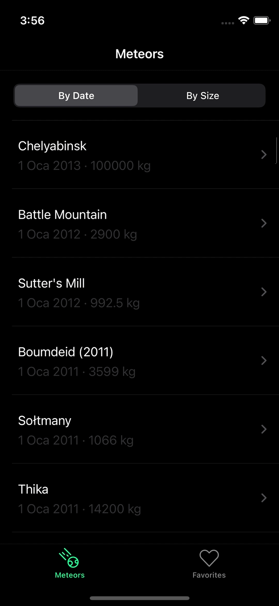

## Meteors iOS App
Sample iOS application presenting usage of MVVM pattern using NASA Meteors API.

## Description
Project provides listing meteors and showing details about meteors that fell on earth. They are also can storable on local file.

Project consuming https://data.nasa.gov/resource for data source.

## Technical Features
- Using UIKit as interface building by programmatically.
- Project splitted to layers as network, business and UI.
- A Separate framework created for networking called RestClient and it's supported by unit tests.
- Using FileManager for persistency.

## Environment
- Xcode 13.2.1
- Swift 5.0
